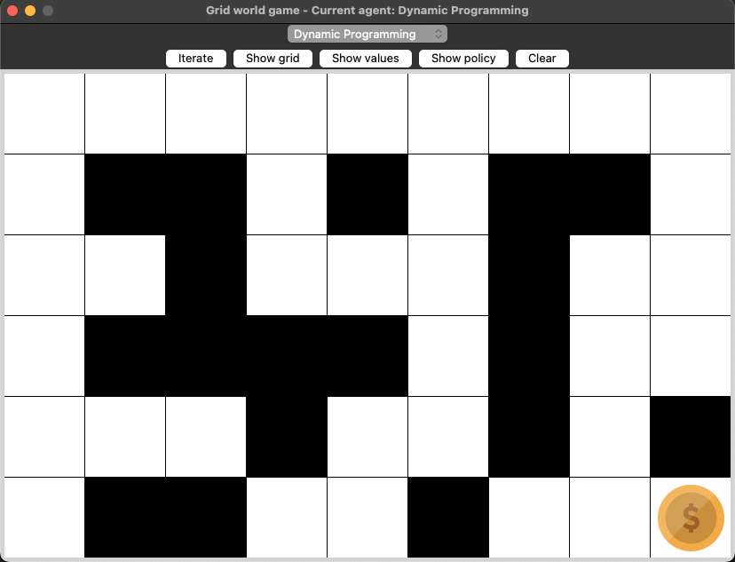
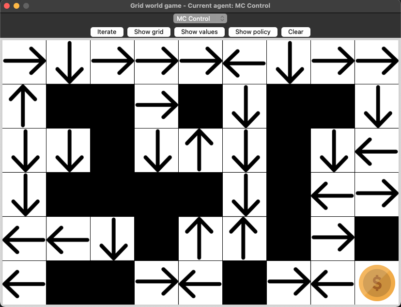
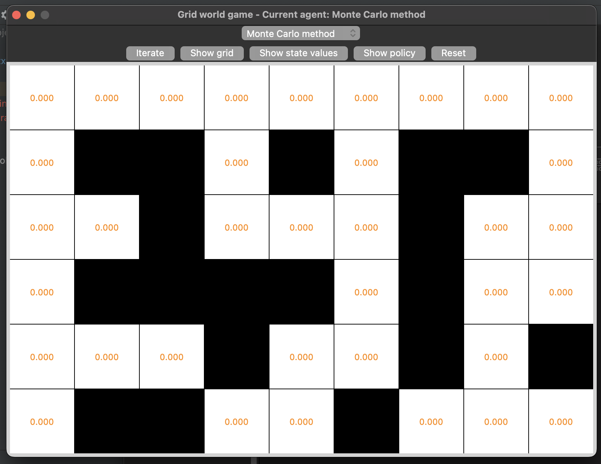
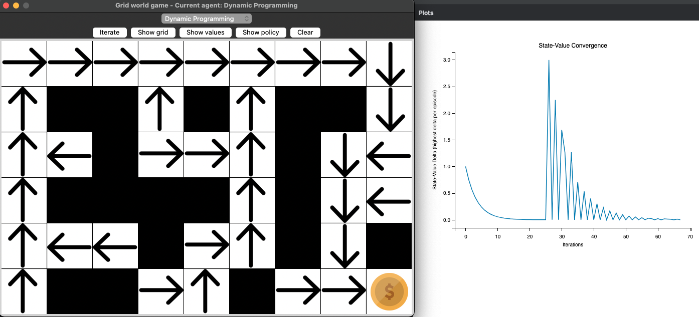

# RL-Gridworld: A RL-Learning Environment

Welcome to the __RL-Gridworld__, an open-source resource designed for learning and experimenting with various paradigms in reinforcement learning (RL). 
This library provides a versatile gridworld environment that can be easily extended and customized, making it an ideal tool for both beginners and experienced practitioners.

This project is an example for using three methods for solving the Bellman equations:
* Dynamic Programming
* Monte Carlo Method
* Temporal Difference Learning

Each approach can be implemented in the respective file and can be selected in the GUI of the GridWorld example.

## Features
* __Extensible Gridworld Environment__: At the core of this library is the gridworld environment, a simple yet powerful tool for demonstrating key concepts in RL. 
Users can easily modify and extend this environment to suit their learning and research needs.
  
* __Support for Multiple RL Paradigms__: The library is built to demonstrate a variety of reinforcement learning techniques, including:
  * Monte-Carlo Learning
  * Dynamic Programming
  * Temporal Difference Learning

## Environment dynamics

The environment acts the following way:
* Every move results in a reward of `-1`
* Moving into the wall will also yield a reward of `-1`, however the agent's position doesn't change
* Moving out of the grid will also yield a reward of `-1`, however the agent's position doesn't change
* When being in the goal, no more action is possible (terminal state)

## Configuration

The grid world layout can be adjusted in the `main.py` file.
It can be configured the following way:
* _g_ indicated the goal
* _1_ indicates a wall
* _0_ indicates an accessible state
* Multiple goals are possible!
* The dimensions of the grid are adjustable! One can try out multiple sizes and test each algorithm with it!
* Currently, only random start-positions are supported. Setting a fixed starting point for all episodes will be available soon.

## Solutions for algorithms
The solution for the algorithms is in the directory `agents/solutions`. These are currently used in the main.py in order to see that the example is working.
When assigning the task to the students, the solutions directory should be removed and the regular algorithms (`dp_iteration_strategy.py`, `mc_iteration_strategy.py`, `td_iteration_strategy.py`) referenced in the `main.py`.

# Installing and running the program
All required packages are in resources/requirements.txt.
To install the requirements, execute `pip install -r resources/requirements.txt`.
Best practice is to create a 'venv' with python version 3.9, then install the `resources/requirements.txt` using the command above with the created venv.

Run the `main.py` file with python 3.9 to run the program!

## Example images
Here are some examples of the project with implemented algorithms:

### Empty Gridworld


### Initialized Policy


### Initialised State Values


### An iteration of Dynamic Programming


### Optimal Policy using Dynamic Programming


## References
The drl_board.py is based on the source code ot the python package `game2dboard` which uses the provided [game2dboard-MIT-Licence](https://github.com/kitaird/drl-gridworld/blob/develop/resources/game2dboard-LICENSE.txt) under `resources/game2dboard-LICENSE.txt`.
The initial `board.py` from `mjbrusso/game2dboard` was extended to contain additional buttons and logic for the purpose of this project.

## License
This project is licensed under the MIT License - see the [MIT-Licence](https://github.com/kitaird/drl-gridworld/blob/develop/LICENSE.txt) file for details.

## Citation
If you use this project in your research, please cite it like so:
```bibtex
@misc{gashi2021rl-gridworld,
      title={RL-Gridworld: A RL-Learning Environment},
      author={Adriatik Gashi},
      institution = {Darmstadt University of Applied Sciences},
      howpublished = {\textsc{url:}~\url{https://github.com/kitaird/drl-gridworld}},
      year={2021}
}
```