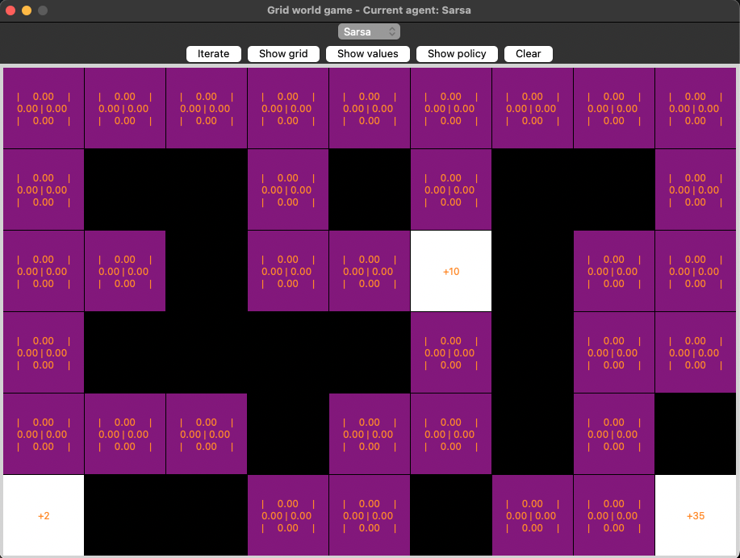
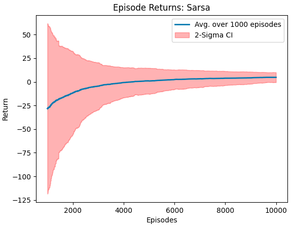

# RL-Gridworld: A RL-Learning Environment

Welcome to the __RL-Gridworld__, an open-source resource designed for learning and experimenting with various paradigms in reinforcement learning (RL). 
This library provides a versatile gridworld environment that can be easily extended and customized, demonstrating how RL-Algorithms achieve their solutions.

All control approaches can be implemented in the respective file and can be selected in the GUI of the GridWorld example.


## Features
* __Gymnasium Interface__: The gridworld environment is designed to be compatible with the popular RL-interface [Gymnasium](https://github.com/Farama-Foundation/Gymnasium), allowing users to transition their gained knowledge easily to more sophisticated DRL-libraries.

* __Extensible Gridworld Environment__: At the core of this library is the gridworld environment, a simple yet powerful tool for demonstrating key concepts in RL. 
Users can easily modify and extend this environment to suit their learning and research needs.

* __Support for Multiple RL Paradigms__: The library is built to demonstrate a variety of reinforcement learning techniques (see Sutton & Barto, Reinforcement Learning: An Introduction, 2018), including:
  * Dynamic Programming:
    * Policy Iteration 
    * Value Iteration
  * Monte Carlo Methods:
    * On-Policy Monte-Carlo Control
    * On-Policy Monte-Carlo Control with Exploring Starts
    * Off-Policy Monte-Carlo Control
  * Temporal Difference Learning:
    * Sarsa
    * Expected Sarsa
    * Q-Learning
  * N-Step bootstrapping:
    * N-Step Sarsa
    * N-Step 
    * N-Step Tree Backup
    * Off-Policy N-Step Sarsa
    * Off-Policy N-Step Q(sigma)

## Environment dynamics

The environment acts the following way, but can be configured freely as described below:
* Every move results in a reward of `-1`
* Moving into the wall will also yield a reward of `-1`, however the agent's position doesn't change
* Moving out of the grid will also yield a reward of `-1`, however the agent's position doesn't change
* When being in a terminal state, no more action is possible

## Configuration

The gridworld layout can be adjusted in the `src/env/gridworld-config.yml` file.
It can be configured the following way:
### Gridworld configuration
* **Horizon**: The maximum number of steps the agent can take in the environment (defines truncation)
* **Action_space**: The possible actions the agent can take (cardinal_moves: [North, South, East, West], queen_moves: [N, S, E, W, NE, NW, SE, SW])
* **Layout**:
  * **s** : indicates the agent's starting position
  * **w** : indicates a wall
  * **.** : indicates an accessible state
  * **t** : indicates a terminal state
* **Rewards**:
  * **#** : indicates a reward issued when entering that state (where # is any int or float, else the default reward is 0)
* **Reward_per_step**: The reward issued for every step the agent takes
* Multiple terminal states are possible.
* Rewards and terminal states are decoupled.
* The dimensions of the grid are adjustable. One can try out multiple sizes and test each algorithm with it.

## Solutions for algorithms
The solutions for the algorithms are in the directory `agents/solutions/...`.
When assigning the task to the students, the solutions directory should be removed and the `agents/templates/...` versions should be referenced in the `__main__.py`.

# Installing and running the program
All required packages are in resources/requirements.txt.
To install the requirements, execute `pip install -r resources/requirements.txt`.
Best practice is to create a 'venv' with python version 3.9, then install the `resources/requirements.txt` using the command above with the created venv.

Run the `__main__.py` file with python 3.9 to run the program!

## Example images
Here are some examples of the project with implemented algorithms:

### Empty Gridworld


### Empty Gridworld with Agent starting position


### Initialised Action Values


## Example images using Sarsa
### Converged Action Values


### Optimal Policy


### Episode Returns


## References
The rl_board.py is based on the source code ot the python package `game2dboard` which uses the provided [game2dboard-MIT-Licence](https://github.com/kitaird/rl-gridworld/blob/develop/resources/game2dboard-LICENSE.txt) under `resources/game2dboard-LICENSE.txt`.
The initial `board.py` from [mjbrusso/game2dboard](https://github.com/mjbrusso/game2dboard) was extended to contain additional buttons and logic for the purpose of this project.

## License
This project is licensed under the MIT License - see the [MIT-Licence](https://github.com/kitaird/rl-gridworld/blob/develop/LICENSE.txt) file for details.

## Citation
If you find this project helpful and use it, please cite it like so:
```bibtex
@misc{gashi2023rl-gridworld,
      title={RL-Gridworld: A RL-Learning Environment},
      author={Adriatik Gashi},
      institution = {Darmstadt University of Applied Sciences},
      howpublished = {\textsc{url:}~\url{https://github.com/kitaird/rl-gridworld}},
      year={2023}
}
```